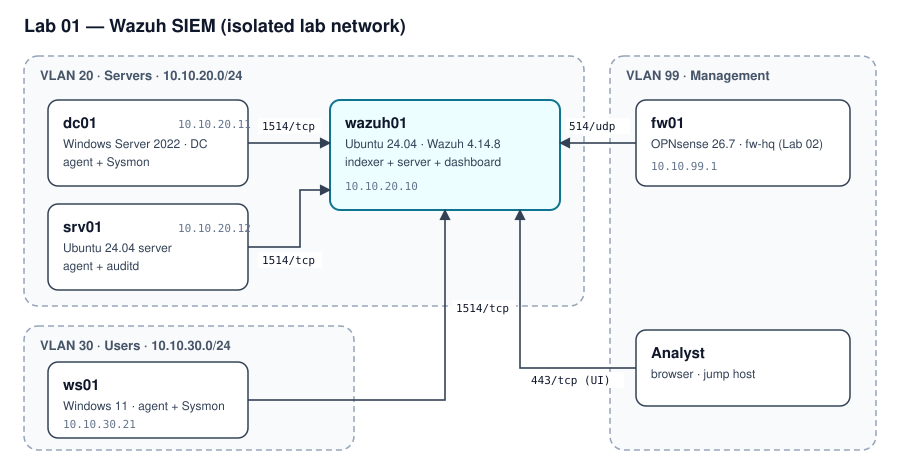

# Wazuh SIEM Home Lab

> **TL;DR** — Reference architecture for a single-node Wazuh SIEM protecting a fictional 40-person company:
> Windows (Sysmon), Linux (auditd) and firewall telemetry, eight detection use cases mapped to MITRE ATT&CK,
> version-pinned tooling and a tested measurement pipeline. **Deliverable: reference design, ready to build.**

| | |
|---|---|
| **Role played** | Security engineer for a 40-person company with no SOC |
| **Environment** | Proxmox VE, 5 VMs, isolated lab network (3 VLANs) |
| **Tools** | Wazuh 4.14.8, Sysmon (sysmon-modular), auditd, OPNsense, Python |
| **Deliverable** | Architecture, detection plan, pinned build scripts, tested reporting tools |

---

## 1. Problem

- **Context:** a fictional 40-person professional-services company runs a Windows domain, a Linux server
  and a perimeter firewall. Logs stay on each machine and nobody reviews them.
- **Why it matters:** credential theft, persistence and privilege abuse would go unnoticed for weeks. The
  company can't afford a commercial SIEM or a 24/7 SOC.
- **Goals:**
    1. Centralise Windows, Linux and firewall telemetry in one open-source SIEM.
    2. Detect 8 attacker behaviours that matter for a company this size, mapped to MITRE ATT&CK.
    3. Keep alert volume low enough for one part-time person to review daily.
    4. Make the whole lab reproducible from this repository.
- **Scope & constraints:** open-source tooling only; evaluation licences for Windows; everything runs in an
  isolated lab with no route to any production network.
- **Success criteria:** every use case has a recorded detection result; daily alert volume measured before
  and after tuning; the build reproducible from the scripts in this repo.

## 2. Architecture

| Host | OS | Role | IP | Sizing |
|---|---|---|---|---|
| wazuh01 | Ubuntu 24.04 | Wazuh indexer + server + dashboard | 10.10.20.10 | 4 vCPU, 8 GB RAM, 80 GB |
| dc01 | Windows Server 2022 (eval) | Domain controller `corp.internal`; agent + Sysmon | 10.10.20.11 | 2 vCPU, 4 GB, 60 GB |
| srv01 | Ubuntu 24.04 | Linux server; agent + auditd | 10.10.20.12 | 1 vCPU, 2 GB, 20 GB |
| ws01 | Windows 11 (eval) | Domain-joined workstation; agent + Sysmon | 10.10.30.21 | 2 vCPU, 4 GB, 60 GB |
| fw01 | OPNsense 26.7 | Inter-VLAN firewall (fw-hq from Lab 02); syslog to wazuh01 | 10.10.99.1 | 2 vCPU, 4 GB, 32 GB |

- **Data flows:** agents → wazuh01 on 1514/tcp (encrypted agent protocol); fw01 → wazuh01 syslog on 514/udp;
  analyst → Wazuh dashboard on 443/tcp from the management VLAN only.

| Decision | Alternatives considered | Why this one |
|---|---|---|
| Wazuh single-node, native install | Elastic Security; Wazuh in Docker | Free, includes agents, FIM, SCA and active response; native install matches how a small company would run it |
| Version pinned (4.14.8) with installer checksum | "Latest" installer | Reproducible builds; an unexpected upstream change stops the install instead of silently differing |
| Sysmon with sysmon-modular | SwiftOnSecurity config; no Sysmon | Maintained, modular, and tagged with ATT&CK techniques |
| OPNsense as the firewall | FortiGate-VM trial; pfSense CE | The free FortiGate trial is too limited (see lessons); OPNsense is built and documented in [Lab 02](https://github.com/santorest/lab-02-segmented-network); the syslog path stays the same if a licensed FortiGate replaces it |

## 3. Build

1. **Prerequisites** — Proxmox host with ≥32 GB RAM; isolated bridge/VLANs 20, 30, 99; Windows Server 2022
   and Windows 11 evaluation ISOs; Ubuntu 24.04 ISO; the OPNsense firewall from [Lab 02](https://github.com/santorest/lab-02-segmented-network).
2. **Wazuh server** — on wazuh01 run [`scripts/deploy/install-wazuh.sh`](scripts/deploy/install-wazuh.sh). It
   downloads the official 4.14.8 installer, **verifies its SHA-256**, and installs the indexer, server and
   dashboard. Store the generated admin password in a password manager.
3. **Agents** — enroll dc01, ws01 and srv01 following the official Wazuh 4.14 agent documentation; collection
   settings live in [`configs/agents/`](configs/agents/).
4. **Sysmon** — install on dc01 and ws01 with the pinned sysmon-modular configuration
   ([`configs/sysmon/README.md`](configs/sysmon/README.md)).
5. **Firewall logs** — point OPNsense remote syslog at wazuh01 (Lab 02, guide 08).
6. **Baseline** — let the lab run with normal activity for one week and export daily alert counts with
   [`scripts/report/export_alert_metrics.py`](scripts/report/export_alert_metrics.py).

> **Build notes:** gotchas and fixes are logged in [`docs/build-notes.md`](docs/build-notes.md).

## 4. Detection plan

The detection plan: each use case names the host it runs on, the behaviour to detect and the telemetry that
makes it visible. Use cases are exercised only inside the isolated lab (VM snapshot before, revert after),
following the upstream Atomic Red Team documentation for the pinned release; outcomes are recorded in
[`tests/test-plan.md`](tests/test-plan.md).

| # | Host | ATT&CK | Behaviour | Telemetry |
|---|---|---|---|---|
| T1 | ws01 | T1059.001 | Obfuscated PowerShell | Sysmon process creation, PowerShell script-block logging |
| T2 | ws01 | T1003.001 | LSASS credential access | Sysmon process access |
| T3 | ws01 | T1547.001 | Registry Run-key persistence | Sysmon registry events |
| T4 | dc01 | T1136.002 / T1098 | New domain account added to a privileged group | Windows Security account-management events |
| T5 | dc01 | T1070.001 | Security log cleared | Windows Security log events |
| T6 | srv01 | T1110.001 | SSH password guessing | sshd authentication logs |
| T7 | srv01 | T1098.004 | SSH `authorized_keys` modification | File integrity monitoring + auditd |
| T8 | fw01 | T1046 | Network service discovery (scan) | Firewall logs via syslog |

## 5. Deliverables and measurement

**Delivered in this repository:**

- Architecture and sizing for a five-VM, three-VLAN lab ([diagram](diagrams/architecture.svg)).
- Detection plan: eight use cases mapped to MITRE ATT&CK and to the telemetry each one needs.
- A version-pinned Wazuh 4.14.8 installer that verifies the upstream checksum before running.
- A reporting pipeline tested in CI: [`export_alert_metrics.py`](scripts/report/export_alert_metrics.py)
  exports daily alert counts from the Wazuh indexer and [`coverage_table.py`](scripts/report/coverage_table.py)
  turns the test plan and those exports into the results tables.

**How results are measured** (`python scripts/report/coverage_table.py`):

| Metric | Definition |
|---|---|
| Detection coverage | Use cases that produced an alert ÷ use cases tested, before and after tuning |
| Alert volume | Average alerts per day during a one-week baseline versus a week after tuning |
| Reduction | Relative change in daily alert volume from baseline to tuned |

Coverage is only reported once every use case has a recorded outcome, so a figure can never be computed
from a favourable subset of tests.

## 6. Design lessons and roadmap

- **Pin versions and verify what you download.** A "latest" installer makes a lab impossible to reproduce
  months later. Pinning Wazuh 4.14.8 and checking the installer's SHA-256 turns silent upstream drift into a
  visible stop.
- **Check licence limits before designing around a product.** The free FortiGate-VM trial allows only three
  interfaces, policies and routes and has no FortiGuard updates, so the firewall log source uses
  OPNsense ([Lab 02](https://github.com/santorest/lab-02-segmented-network)), which has no such limits. The syslog path stays the same if a licensed FortiGate replaces it.
- **Plan telemetry before rules.** Most Windows use cases depend on Sysmon, the advanced audit policy and
  PowerShell script-block logging being in place first; a rule has nothing to match without them. Each use case
  therefore names its telemetry source.
- **Size the SIEM first.** The Wazuh indexer alone needs 8 GB of RAM and the full lab about 19 GB, which is
  what sets the ≥32 GB host requirement.
- **Define metrics before collecting data.** Writing the coverage and alert-volume definitions (and the rule
  that partial results aren't reported) before any test runs keeps the results honest.

**Roadmap:** build the lab from this design, collect a one-week baseline, exercise the eight use cases, write
custom rules for any gaps, tune, and publish the measured coverage and alert-volume results here.

## 7. Reproduce it yourself

- Clone: `git clone https://github.com/santorest/lab-01-wazuh-siem.git`
- Download bundle: from the portfolio site (SHA-256 shown next to the download).
- Estimated time: 1–2 days to build, plus one week of baseline.
- Teardown: delete the lab VMs and the isolated bridge; no cloud resources are used.

## 8. Mapping

| Control / technique | Framework | How this project addresses it |
|---|---|---|
| 8.2 Collect audit logs · 8.9 Centralize audit logs | CIS Controls v8 | Agents and syslog forward all telemetry to wazuh01 |
| 8.11 Conduct audit log reviews | CIS Controls v8 | Daily review workflow sized by the alert-volume metric |
| T1059.001, T1003.001, T1547.001, T1136.002, T1098, T1070.001, T1110.001, T1098.004, T1046 | MITRE ATT&CK | One use case each (section 4) |

---

*All testing is performed in an isolated lab environment I own. No real organization's data, hostnames or
configurations are included.*
